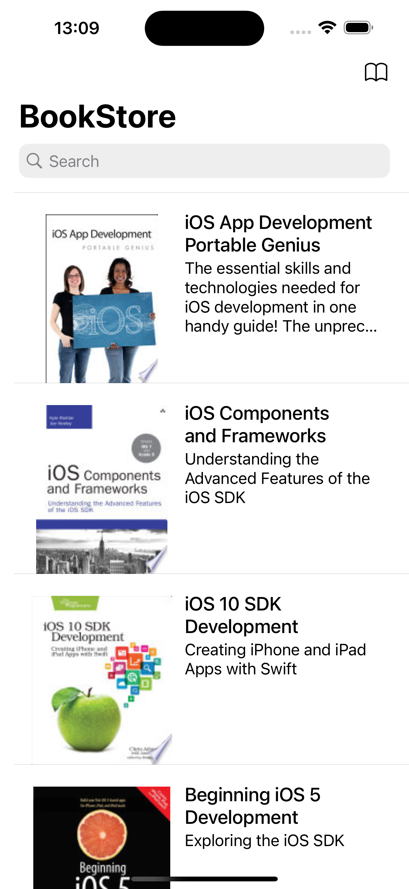
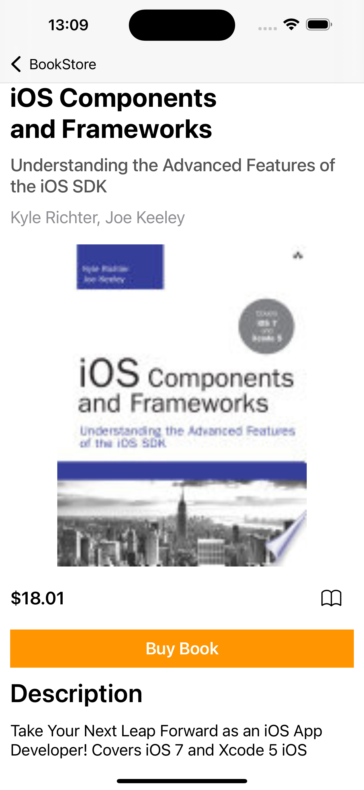
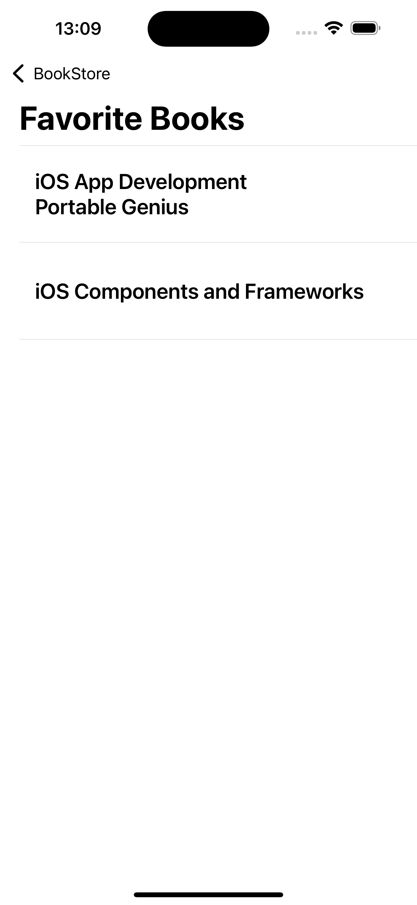

# iOS BookStore App - Google Books API 


 


## About:
A very simple BookStore application that was build to provide information about iOS books using [Google Books API](https://developers.google.com/books/docs/v1/using). The app contains a list of books with the possibility of obtaining more details about each book, such as author, description and price. 
I've build the app using Storyboard because it's just a proof-of-concept and, for that, it's faster. 
I chose MVVM due to the separation of concerns between the components that the architecture provides, making it easier to test.
For third-party library I used Alamofire to simplify the process of performing network operations and handling server responses and Kingfisher for it's performace when it comes to images. Data persistence with User Defaults has also been implemented to create a list of the user's favorite books, and items can be added or removed from the list.

## Screenshots
  

## Main Features:
- List of iOS Books using UITableView
- Details about the books, such as author(s), description and price
- Deeplink to web page when buying a book
- Images of the books
- Favorite books - Data persistence with User Defaults. 

## Technologies:
- `Swift 5`
- `iOS 17` (minimum version)
- `Storyboard`
- `MVVM` architecture
- `Alamofire` for network
- `Kingfisher` for images
- `User Defaults` for data persistence
- `URL Scheme` to open web page from url


  
## Instalation
First of all, download this repo

```
git clone git@github.com:RonaldMaciel/BookStore
cd BookStore
```

Then install third-party libraries

```
pod install
```

And finally, open it using Xcode to launch in any iOS device or simulator

```
xed .
```
